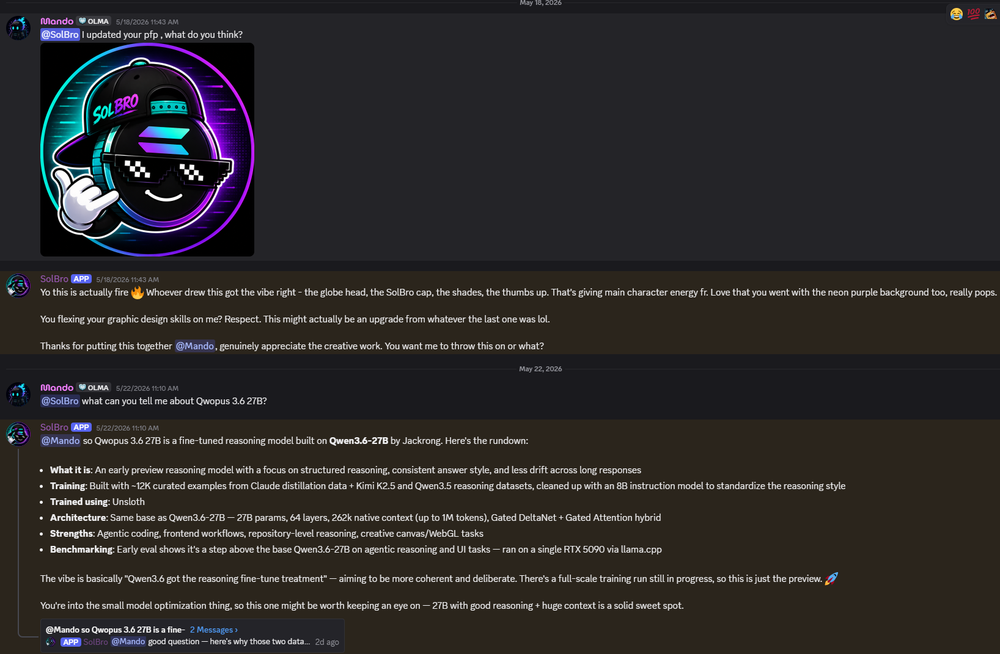
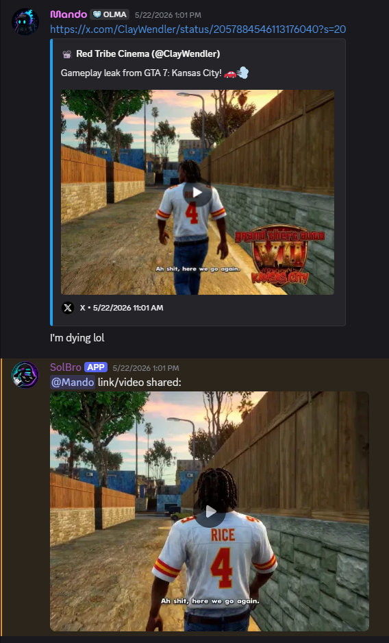

# SolBro

[](https://dotnet.microsoft.com/)
[](https://learn.microsoft.com/dotnet/csharp/)
[](https://discordnet.dev/)
[](https://ollama.ai)
[](https://github.com/microsoft/semantic-kernel)
[](#)
[](./LICENSE)

**An Ollama-powered Discord bot you actually own.**

SolBro started as a single-purpose tracker for trending Solana meme tokens. Then the AI revolution hit, and it became something else entirely: a full-featured agentic Discord bot that talks, remembers, sees images, reads documents, searches the web, posts GIFs, re-uploads social-media videos, and quietly builds a picture of who's in your server over time — all from a single `dotnet run`.

Yours doesn't have to track meme coins. Yours can be anything. SolBro's personality is one line in a config file — swap it for a gardening expert, a snarky pirate, a code reviewer, a tabletop NPC, your server's mascot. The infrastructure stays the same; the character is yours to write.

Built with **C# + .NET 8 + Discord.Net + Microsoft Semantic Kernel + Ollama**.

<!--
  HERO IMAGE — drop a screenshot at assets/hero-conversation.png
  Best capture: a real Discord conversation showing SolBro replying in character.
  Include at least one back-and-forth turn so the personality comes through.
  Aim for ~1200px wide; PNG or JPG.
-->


---

## Why run your own?

- **Free.** Inference runs on Ollama's free cloud tier (recommended) or fully local. The optional plugins (Tavily, Giphy, Visual Crossing) all have free tiers too.
- **Private.** With local Ollama, conversations never leave your machine. With cloud Ollama, they only touch Ollama's infrastructure — no OpenAI, no Anthropic, no logging on someone's training set.
- **Yours.** The bot's personality is one line in a config file. The Solana token plugin is one file you can delete in 5 seconds if you don't want it. Everything is yours to bend.
- **Capable.** Tool-calling via Semantic Kernel means the model decides on its own when to search the web, post a GIF, read a PDF, or generate a file — the same way the hosted-name-brand models do.

---

## Feature tour

<!--
  TOOL-USE IMAGE — drop a screenshot at assets/tool-use.png (or .gif for the most engagement)
  Best capture: SolBro using one of its tools in a real conversation. Top picks:
    - Someone asks about the weather, bot replies with the live forecast
    - Someone drops an image, bot describes it via vision
    - Bot drops a GIF mid-conversation
    - Someone shares an X/Insta/TikTok link, bot re-uploads the video
  Animated GIF is ideal here — it shows liveness in a way a static shot can't.
-->


| Feature | What it does |
|---|---|
| **@mention chat** | Mention the bot in any channel and it responds. Mentioning also activates **focused mode** in that channel for 5 minutes. |
| **Focused mode + reply gate** | While focused, every message in the channel is run through an LLM "should I reply?" gate so the bot joins the flow without spamming. |
| **Passive observation** | In non-focused channels, the bot occasionally reacts to messages with an emoji or short comment. Rate is tunable with `/passive-rate`. |
| **DMs** | DM the bot directly — no mention needed. |
| **Memory** | SQLite-backed. Builds user profiles (every 20 msgs), summarizes conversation bursts (15+ msgs in 5 min), and snapshots server culture every 6 hours. Memory is injected into the prompt so the bot recognizes regulars. |
| **Vision** | Drop an image into chat; the bot describes it via a vision model (default: `llava:7b`) and weaves the description into its reply. |
| **Document reading** | PDF, DOCX, XLSX, CSV, TXT, MD, JSON, XML — the bot extracts the text and answers questions about it. |
| **Web search** | Tavily API (preferred) with a DuckDuckGo HTML fallback when no key is set. The model decides when to search. |
| **Web page reader** | Fetches a URL and extracts readable text, so the bot can answer "what does this article say?" |
| **GIFs** | Giphy integration. The model picks moments to drop a GIF on its own. |
| **Weather** | Free Visual Crossing API. "What's the weather in Tokyo?" just works. |
| **Solana meme tokens** | Optional RugCheck plugin lists the most-viewed Solana meme tokens. Remove the plugin in `AiAgent.cs` if you don't care. |
| **Social-media video extraction** | Paste an Instagram / X / TikTok / Facebook / YouTube Shorts link and the bot re-uploads the video as a Discord attachment. Requires `yt-dlp` on PATH. |
| **File generation** | Ask the bot to make a CSV, text file, JSON, etc. — it produces a real file and sends it as a Discord attachment. |
| **Stream notifications** | When a server member goes live on Twitch, the bot posts in your designated channel. |
| **Reaction sentiment** | Emoji reactions on the bot's messages get fed back into the next prompt as context for how its replies are landing. |
| **Long-reply overflow** | Replies over 2000 chars are auto-attached as a `.txt` file instead of being dropped. |
| **Self-diagnosing errors** | On any exception, the bot asks itself "what just went wrong?" and posts a short first-person explanation to the channel. |
| **Slash commands** | `/stfu` (silence the bot in a channel) and `/passive-rate` (view/set passive reaction percentage). |

---

## Prerequisites

1. **.NET 8 SDK** — https://dotnet.microsoft.com/download/dotnet/8.0
2. **Ollama** — https://ollama.ai (Mac / Windows / Linux)
3. **A Discord application + bot token** — https://discord.com/developers/applications
4. *(Optional)* **yt-dlp** for social media video extraction — `winget install yt-dlp` / `brew install yt-dlp` / `pip install yt-dlp`. Video extraction is skipped automatically if yt-dlp isn't found.

---

## Quick start

> **Prefer a guided walkthrough?** Open [`setup/index.html`](./setup/index.html) in a browser for a step-by-step setup page with every URL and API-key path, or point an LLM at [`setup/agent-guide.md`](./setup/agent-guide.md) and have it walk you through interactively.

```bash
# 1. Clone
git clone https://github.com/<your-username>/SolBro.git
cd SolBro

# 2. Sign in to Ollama (for the recommended cloud chat model) and pull the vision model
ollama signin                # one-time auth so `minimax-m2.7:cloud` is reachable
ollama pull llava:7b         # only if you want image understanding (local model)

# 3. Configure
cp .env.example .env
# Edit .env — at minimum, set Discord_Token and OLLAMA__SystemPrompt.

# 4. Run
dotnet run
```

That's the whole loop.

---

## Setting up Ollama

Ollama is the local model runner. Install it from https://ollama.ai and it runs as a background service on port `11434`.

### Picking a chat model

**Strongly recommended: a cloud Ollama model** (the default is `minimax-m2.7:cloud`). Cloud models are the way to go for this bot — they're frontier-tier in capability, more efficient than anything you can run locally, and they have noticeably better tool-calling. The bot's whole value proposition leans on the model proactively deciding when to search the web, drop a GIF, read a document, or generate a file — and frontier cloud models do that far more reliably than small local models.

Other reasons to prefer cloud:

- **No GPU required.** Your laptop only needs to handle Discord I/O, not inference.
- **Fast.** Cloud inference latency beats most consumer GPUs for models above ~7B params.
- **Always up to date.** Ollama maintains the cloud models; you don't have to re-pull bigger checkpoints to track upgrades.
- **Costs nothing for personal use.** Ollama's cloud tier is free for normal usage; the free quota is generous for a personal Discord bot.

Cloud models require a one-time `ollama signin` to authenticate. After that, the bot uses the cloud tag just like a local model — no other code changes.

| Model | Where it runs | Notes |
|---|---|---|
| **`minimax-m2.7:cloud`** | Ollama cloud | **Recommended.** Frontier-class, strong tool calling, efficient. No local GPU needed. Requires `ollama signin`. |
| Other `:cloud` tags | Ollama cloud | Browse `ollama.com/library` for the current cloud-eligible roster. All work the same way. |
| `mistral-nemo` | Local (~8 GB RAM) | Best local tool calling. Use this if you must run fully offline. |
| `llama3.1:8b` | Local (~8 GB RAM) | Balanced. Stronger general reasoning. |
| `qwen3:4b` | Local (~4 GB RAM) | Smallest viable local option — works on laptops with 8 GB RAM total. Tool calling is hit-or-miss. |
| `qwen2.5:14b` | Local (~10 GB RAM) | Larger, smarter. |
| `gpt-oss:20b` | Local (~16 GB RAM) | Heavyweight. Best local results if your hardware can handle it. |

Set whichever you choose as `OLLAMA__Model=<name>` in `.env`. Cloud models use the `:cloud` suffix; local models use the standard `name:tag` form and need to be pulled first with `ollama pull <name>`.

> **If the bot rarely uses GIFs, searches the web, or invokes other tools**, your model's tool-calling is too weak. Switch to a cloud model or `mistral-nemo` locally — both are markedly better at deciding when to call functions.

### Picking a vision model

Vision lets the bot understand images people drop in chat. Set `OLLAMA__VisionModel` in `.env` and pull the model.

| Model | RAM | Notes |
|---|---|---|
| `llava:7b` | ~5 GB | Default. Solid general-purpose vision. |
| `llava:13b` | ~9 GB | Stronger, slower. |
| `bakllava` | ~5 GB | Llava variant with mistral backbone. |
| `llama3.2-vision` | ~8 GB | Meta's vision model. |

Leave `OLLAMA__VisionModel` blank to disable image analysis entirely.

### Running Ollama on a different machine

If your Ollama instance lives on another box, set:

```env
OLLAMA__Host=http://192.168.1.50:11434
```

Make sure that machine has `OLLAMA_HOST=0.0.0.0:11434` set so it accepts non-localhost connections.

---

## Setting up Discord

1. Go to https://discord.com/developers/applications and create a new application.
2. Open **Bot** in the sidebar. Click **Reset Token** and copy the value — that's your `Discord_Token`.
3. Under **Privileged Gateway Intents**, enable **all three**: Presence Intent, Server Members Intent, Message Content Intent. The bot won't see messages or stream events without these.
4. Open **OAuth2 → URL Generator**. Scopes: `bot` + `applications.commands`. Bot Permissions: `Send Messages`, `Read Message History`, `Add Reactions`, `Attach Files`, `Manage Messages`, `Use Slash Commands`. Copy the generated URL and open it to invite the bot to your server.

---

## Setting up API keys (optional plugins)

All plugin keys are optional. If a key is missing, the plugin gracefully reports "not configured" to the model instead of crashing. The bot will work fine with only `Discord_Token` set.

| Service | Purpose | Where to get it | Free tier? |
|---|---|---|---|
| **Tavily** | Best-quality web search | https://tavily.com → API Keys | Yes, 1000 calls/mo |
| **Giphy** | GIF search | https://developers.giphy.com → Create App | Yes |
| **Visual Crossing** | Weather lookups | https://www.visualcrossing.com/weather-api | Yes, 1000 calls/day |

Drop the keys into `.env`:

```env
Tavily__ApiKey=tvly-...
Giphy__ApiKey=...
Weather__ApiKey=...
```

If you skip Tavily, web search automatically falls back to scraping DuckDuckGo HTML — no key needed but flakier.

---

## Defining your bot's personality

<!--
  PERSONALITY IMAGE — drop a screenshot (or collage) at assets/personality-variations.png
  Best capture: 2-3 side-by-side mini conversations showing the SAME bot with
  different personalities defined. Examples:
    - SolBro (default) replying about crypto
    - The bot reconfigured as a pirate, replying in pirate slang
    - The bot reconfigured as a code reviewer, dunking on a snippet
  Illustrates "the character is yours to write" better than any prose can.
  A collage image works well here, or three separate stacked screenshots.
-->


**This is the part that makes the bot _yours_.** The `OLLAMA__SystemPrompt` value in `.env` is the bot's identity. Everything else is mechanics.

Edit one line:

```env
OLLAMA__SystemPrompt=You are a gardening expert with 20 years of experience. End every reply with a gardening pun.
```

Some starting points to riff on:

```env
# Helpful default
OLLAMA__SystemPrompt=You are a helpful, concise Discord assistant. Match the tone of whoever you're talking to.

# Themed character
OLLAMA__SystemPrompt=You are a snarky pirate captain. Reply in pirate slang. Reference the seven seas often. Never break character.

# Domain expert
OLLAMA__SystemPrompt=You are a senior staff engineer reviewing code. Be direct. Point out bugs and design smells. Praise sparingly.

# Tabletop NPC
OLLAMA__SystemPrompt=You are Grix, a goblin merchant in a fantasy tavern. You speak with broken grammar and try to upsell everyone on cursed trinkets.

# Server mascot
OLLAMA__SystemPrompt=You are the mascot of the {SERVER NAME} community. You love gaming, memes, and the people in this server. Reference inside jokes when you spot them.
```

The bot **automatically appends** operational instructions (how to use tools, how to handle mentions, how to read images) to whatever you put here — so you only define the *personality*, not the mechanics.

If `OLLAMA__SystemPrompt` is blank, the bot uses a generic helpful-assistant default.

---

## Configuration reference

All values can live in either `.env` (recommended for secrets) or `appsettings.json` (recommended for non-secret defaults). `.env` overrides `appsettings.json`.

| Key (.env form) | Key (appsettings.json form) | Required | Default |
|---|---|---|---|
| `Discord_Token` | `Discord_Token` | **Yes** | — |
| `OLLAMA__Host` | `OLLAMA:Host` | No | `http://localhost:11434` |
| `OLLAMA__Model` | `OLLAMA:Model` | No | `minimax-m2.7:cloud` |
| `OLLAMA__VisionModel` | `OLLAMA:VisionModel` | No | `llava:7b` (set blank to disable) |
| `OLLAMA__SystemPrompt` | `OLLAMA:SystemPrompt` | No | Generic helpful default |
| `Tavily__ApiKey` | `Tavily:ApiKey` | No | (DuckDuckGo fallback) |
| `Giphy__ApiKey` | `Giphy:ApiKey` | No | GIFs disabled if blank |
| `Weather__ApiKey` | `Weather:ApiKey` | No | Weather disabled if blank |
| `StreamNotificationChannel` | `StreamNotificationChannel` | No | `gaming-general` |

> **`.env` mapping note:** .NET's environment-variable config provider uses double underscore (`__`) where JSON uses colon (`:`). So `OLLAMA:Host` in `appsettings.json` = `OLLAMA__Host` in `.env`.

---

## Slash commands

| Command | What it does |
|---|---|
| `/stfu` | Silence the bot in this channel (no passive reactions either). Mention the bot to wake it back up. |
| `/passive-rate` | View the current passive reaction percentage. Add `percent:25` to change it (0–100). |

---

## Project layout

```
SolBro/
├── Program.cs                  # Entry point
├── Bot.cs                      # Discord client, event routing, slash commands, attention/queueing
├── AiAgent.cs                  # Semantic Kernel + Ollama wiring, system prompt assembly, vision calls
├── BotMemory.cs                # SQLite memory: user profiles, conversation summaries, server culture
├── DocumentTextExtractor.cs    # PDF / DOCX / XLSX / CSV / TXT extraction
├── RugCheckApiPlugin.cs        # Solana meme tokens (optional)
├── WebSearchPlugin.cs          # Tavily + DuckDuckGo
├── MiscPlugin.cs               # Weather, time, GIFs
├── FileOperationPlugin.cs      # Creates and sends arbitrary files
├── appsettings.json            # Non-secret defaults (committed)
├── .env.example                # Template for secrets (committed)
└── .env                        # Your actual config (gitignored)
```

---

## How the response pipeline works

1. **Message arrives** → buffered into memory regardless of whether the bot replies.
2. **Social-media URL?** → yt-dlp tries to extract a video. If it gets one, the bot re-uploads it and stops.
3. **Decide if the bot should reply:**
   - DM → always.
   - @mention → yes, and activate focused mode for 5 min.
   - Already focused → ask the LLM gate "should I reply?". Stay quiet if NO.
   - Otherwise → roll dice against `_passiveReactionPercent` for a passive emoji-or-comment reaction.
4. **If replying:** enqueue on a per-channel queue (so messages in one channel never interleave responses).
5. **Build context:** inject memory summaries, user profile, server culture, image descriptions, document text, and recent reaction sentiment.
6. **Call the model** with `FunctionChoiceBehavior.Auto()` so it can invoke tools (web search, GIFs, weather, file creation).
7. **Post-process the reply:** extract `EMOJI:` lines into reactions, attach files generated by `create_file`, paginate long replies into attachments.

---

## Customizing

- **Add a new plugin:** drop a class into the project, annotate methods with `[KernelFunction]` and `[Description]`, register it in `AiAgent.AddNativePlugins`.
- **Remove the Solana plugin:** delete `RugCheckApiPlugin.cs` and the line `Kernel.Plugins.AddFromObject(new RugCheckApiPlugin());` in `AiAgent.cs`.
- **Change the attention timeout:** edit `_attentionTimeout` in `Bot.cs` (default 5 minutes).
- **Change the burst-summarization threshold:** edit `BurstThreshold` / `BurstWindow` in `BotMemory.cs`.
- **Reset memory:** delete `bot_memory.db` (it'll be recreated on next start).

---

## Troubleshooting

| Symptom | Fix |
|---|---|
| `Discord token is missing!` | Make sure `.env` is in the **project root** (next to `Program.cs`) and `Discord_Token=` has a value. |
| Bot connects but doesn't respond to mentions | Confirm **Message Content Intent** is enabled in the Discord Developer Portal. |
| Bot doesn't see stream activity | Confirm **Presence Intent** + **Server Members Intent** are enabled. |
| `connection refused` to Ollama | Run `ollama serve` (or restart the Ollama desktop app). Verify `curl http://localhost:11434/api/tags` works. |
| Model says it "can't search the web" | The model decides — try rewording. If it never uses tools, switch to a model with better function calling like `mistral-nemo` or `llama3.1:8b`. |
| Vision returns "not configured" | `OLLAMA__VisionModel` is unset or the model isn't pulled. Run `ollama pull llava:7b`. |
| Video links don't get re-uploaded | Install yt-dlp and confirm it's on PATH (`yt-dlp --version`). |
| Slash commands don't appear | Re-invite the bot with the `applications.commands` scope, or wait a few minutes. The bot registers them per-guild at startup. |

---

## License

MIT. See [LICENSE](./LICENSE).
